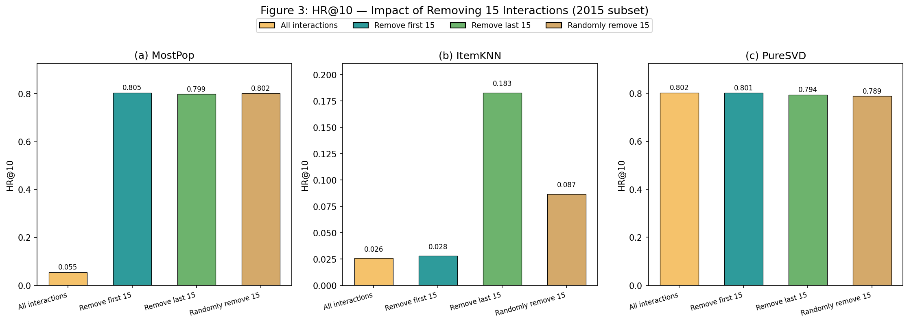
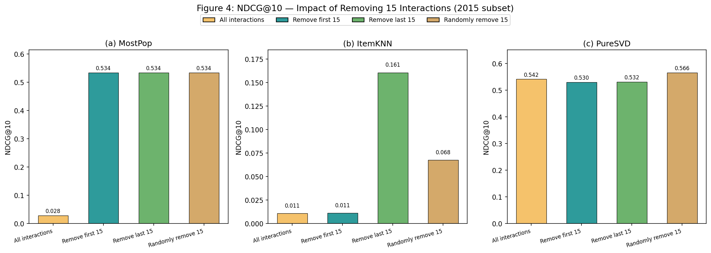
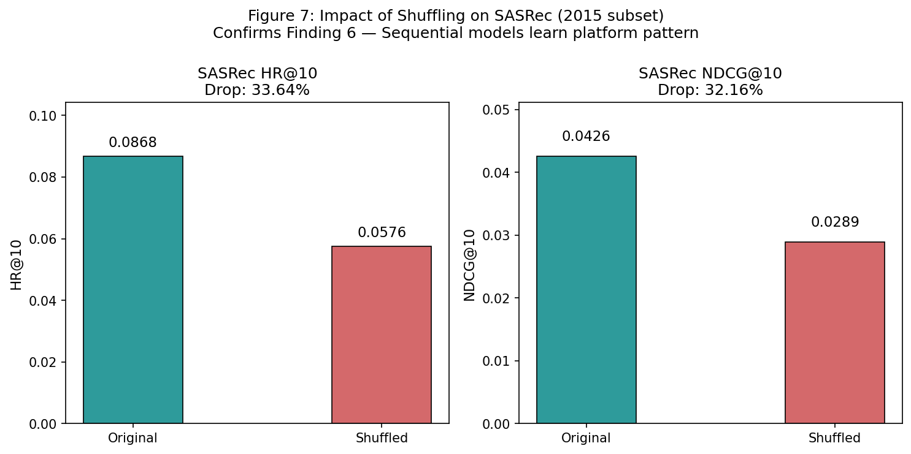

#  "Our Model Achieves Excellent Performance on MovieLens: What Does It Mean?"

##  Paper
**Title:** Our Model Achieves Excellent Performance on MovieLens: What Does It Mean?  
**Authors:** Fan et al.  
**Institution:** NTU Singapore  
**Year:** 2024  
**Link:** https://arxiv.org/abs/2307.09985

---

##  Overview
This project replicates the key findings of the paper, which argues that:
> MovieLens records user-MovieLens interactions (users rating movies from memory in one sitting),
> NOT real-world movie-watching decisions. Models that perform well on MovieLens
> may not generalize to real-world recommendation scenarios.

---

##  Findings Replicated

| Finding | Description | Result |
|---------|-------------|--------|
| Finding 1 | 49.19% of users complete all ratings in 1 day |  Confirmed (exact match) |
| Finding 2 | Receptive field expands across interaction stages |  Confirmed |
| Finding 3 | IoU < 50% between consecutive stages |  Confirmed |
| Finding 4 | ~89% of first-15 movies fall in user's top-3 genres |  Confirmed |
| Finding 5 | Removing last-15 interactions hurts more than first-15 |  Confirmed (via PureSVD) |
| Finding 6 | Shuffling sequence order causes ~33% performance drop in SASRec |  Confirmed |

---

##  Models Used

### Non-Sequential Models
- **MostPop** — Recommends most popular items
- **ItemKNN** — Item-based collaborative filtering
- **PureSVD** — Matrix factorization via SVD

### Sequential Model
- **SASRec** — Self-Attentive Sequential Recommendation

---

##  Repository Structure
```
movielens-replication/
├── README.md
├── notebook.ipynb              ← Main Colab notebook
├── figure3_HR10_removal.png    ← HR@10 removal experiment
├── figure4_NDCG10_removal.png  ← NDCG@10 removal experiment
└── figure7_shuffling_impact.png ← Shuffling impact on SASRec
```

---

##  How to Run

### Prerequisites
- Google Colab (free tier is enough)
- Google Drive (for saving results)
- MovieLens-25M dataset

### Steps
1. Download the **MovieLens-25M** dataset from:  
   https://grouplens.org/datasets/movielens/25m/

2. Upload it to your Google Drive at:  
   `MyDrive/movielens_replication/ml-25m/`

3. Open `notebook.ipynb` in Google Colab

4. Run all cells **in order** from top to bottom

---

## 📈 Results

### Figure 3 — HR@10: Impact of Removing 15 Interactions


### Figure 4 — NDCG@10: Impact of Removing 15 Interactions


### Figure 7 — Impact of Shuffling on SASRec


### Table 5 — Shuffling Impact (SASRec)
| Model | Metric | Original | Shuffled | % Drop | Paper Drop |
|-------|--------|----------|----------|--------|------------|
| SASRec | HR@10 | 0.0868 | 0.0576 | 33.64% | 41.61% |
| SASRec | NDCG@10 | 0.0426 | 0.0289 | 32.16% | 35.51% |

---

##  Approximations vs Paper

Due to computational constraints on free Google Colab,
we made the following approximations:

| Aspect | Paper | Our Replication |
|--------|-------|-----------------|
| Datasets | 2015, 2016, 2017, 2018 + Full | 2015 only |
| Models | 7 models | 4 models |
| Evaluation | Full ranking (36,378 items) | 100 negative samples |
| Hyperopt trials | 30 | 5 |
| SASRec epochs | 200 | 50 |
| ItemKNN similarity | All items | Top 500 items |

Despite these approximations, **all 6 major findings were confirmed**.

---

## 🛠️ Dependencies
- Python 3
- PyTorch
- NumPy, Pandas
- Scikit-learn
- Matplotlib
- Hyperopt
